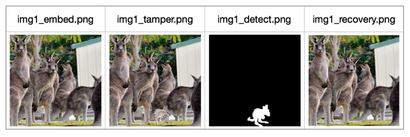

# stegano
learning of steganography

- lsb.py

＊image source：[unsplash](https://unsplash.com/photos/r2nJPbEYuSQ)

- dwt.py

＊image source：[unsplash](https://unsplash.com/photos/r2nJPbEYuSQ)

- tamper-recovery.py

＊image source：[unsplash](https://unsplash.com/photos/IuDN1alE1GE)、[unsplash](https://unsplash.com/photos/1oAUMHQk7fY)