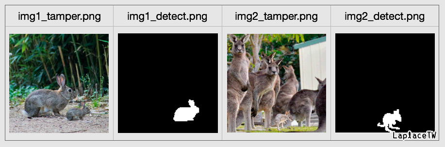
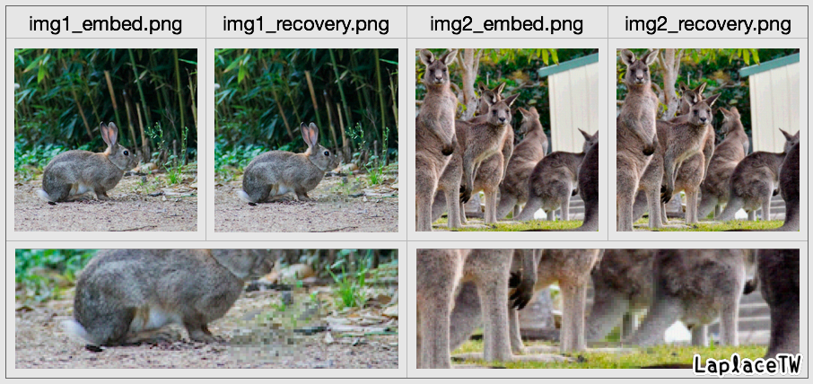

# stegano
learning of steganography

### lsb.py

＊image source：[unsplash](https://unsplash.com/photos/r2nJPbEYuSQ)

### dwt.py

＊image source：[unsplash](https://unsplash.com/photos/r2nJPbEYuSQ)

### tamper-recovery.py
- [The Study of Copyright Protection and Content Authentication for Digital Images](https://hdl.handle.net/11296/ymq83x)

＊image source：[unsplash](https://unsplash.com/photos/IuDN1alE1GE)、[unsplash](https://unsplash.com/photos/1oAUMHQk7fY)